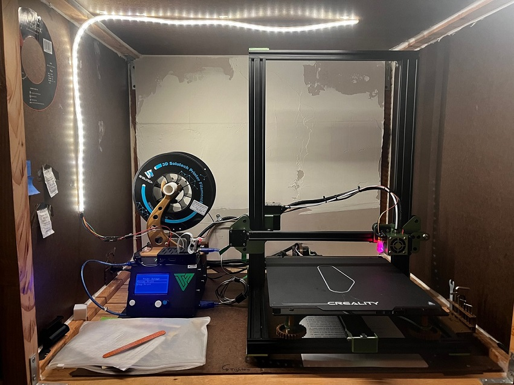

I've been 3D printing for a while now but in the past I had been using the printer available at the local library. The turn around time was not bad at all actually... A few months back I decided to purchase the Tevo Tornado and so far I am very happy with it. Here is a picture of the printer in my shop inside the enclosure that I built for it. My shop can get a little dirty so I made sure that the enclosure is airtight so as to clog up the printer as little as possible. Just to be clear though, I'm not printing knick knacks with my printer, or at least I'm not trying to; I try to print what I need and no more. 

I've printed a bunch of toys(not too many to be wasteful...) with this printer and lately lots of tools such as pocket hole jig, dremel accessory for sharpening drill bits, dremel table top holder, copper couplers, etc. I even printed a tennis racket dampener using the flexible filament PLA material. So far it is holding up. And for now here are the updates that I've made to the printer:

* added a 310mm x 370mm Borosilicate Glass Plate (you need to increase the bed temperature to get good results)
* added leg dampeners to aid with vibration
* added supports for better routing of the cables
* printed a couple of useful tool holders and adjustment tools
* made a few updates to the firmware as per this [Marlin page](https://github.com/arunoda/marlin)
  * for the commands to move the extruder to the left front, right rear, etc., changed the timing when the screen goes back to the main menu. Previously it was too fast like 5 seconds, so I changed it to 30. 

## 2021 Update

The borosilicate glass gave me mixed results although that assessment comes before adding adding a BLTouch.  Anyway, I removed the glass and opted for one of those [flexible removable magnetic thingies](https://www.amazon.com/Creality-3D-Ultra-Flexible-Removable-9-25x9-25/dp/B07GRSDKS9). Add to that a BLTouch, Octopi and the [Bed Level Visualizer plugin](https://plugins.octoprint.org/plugins/bedlevelvisualizer/) and the prints are very consitent. I couldn't stop there. Since I already had Octopi running, I added a camera as well as LED lights to the whole setup. Below is a photo of its current state.

