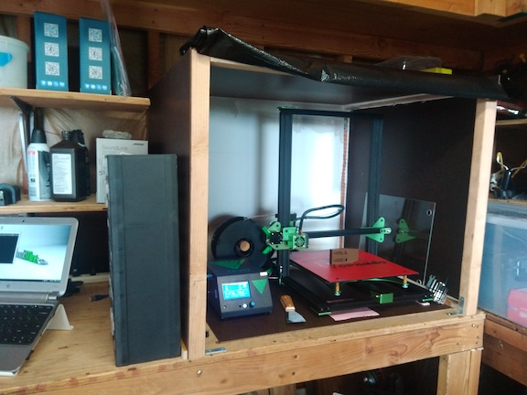

### 3D Printing

I've been 3D printing for a while now but in the past I had been using the printer available at the local library. The turn around time was not bad at all actually... A few months back I decided to purchase the Tevo Tornado and so far I am very happy with it. Here is a picture of the printer in my shop inside the enclosure that I built for it. My shop can get a little dirty so I made sure that the enclosure is airtight so as to clog up the printer as little as possible. 

I've printed a bunch of toys with this printer and lately lots of tools such as pocket hole jig, dremel accessory for sharpening drill bits, dremel table top holder, copper couplers, etc. I even printed a tennis racket dampener using the flexible filament PLA material. So far it is holding up. And for now here are the updates that I've made to the printer:

* added a 310mm x 370mm Borosilicate Glass Plate (you need to increase the bed temperature to get good results)
* added leg dampeners to aid with vibration
* added supports for better routing of the cables
* printed a couple of useful tool holders and adjustment tools
* made a few updates to the firmware as per this [Marlin page](https://github.com/arunoda/marlin)
