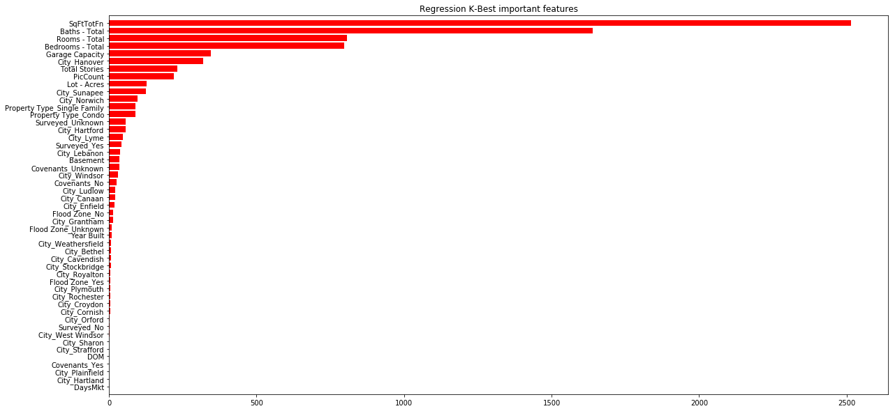
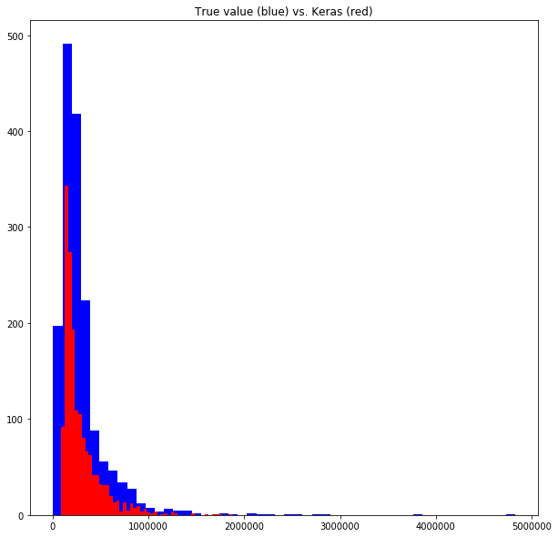
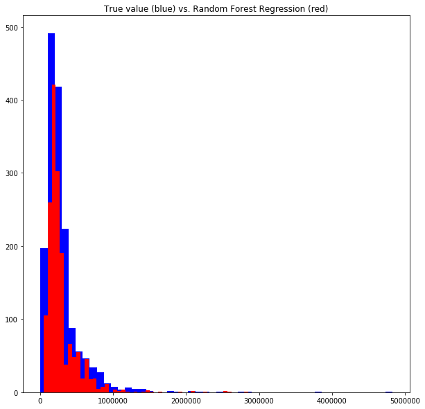

# Keras Machine Learning Exercise

Compare the prediction of house sale prices using a random forest regressor (sklearn.ensemble.RandomForestRegressor) and a sequential neural network (keras.models.Sequential).


## Data loading and preparation 

Data pre-processing, including all of the topics listed below, is very important. In fact, many practicioners consider it to be as important as it is to apply the most pertinent machine learning algorithm.

### Data Splitting/Partitioning
<br>
To properly apply machine learning to this data you would want to partition it into four different groups as mentioned below.  

* **Pre-training/Analysis set (hundreds or perhaps 1K samples)**
  * This data will only be used for you to analyze it and get a feel for the features.
* **Training Set (60% of what is left)**
  * This is the set used for learning the data
* **Cross Validation Set (20% of what is left)**
  * The Training set will learn the data and come up with a model that has parameters. The cross validation set is used to pick the best model/parameters 
* **Testing Set (20% of what is left)**
  * Once you have trained the model with the training set and picked the best parameters using the cross validation set then you test your results using the testing set
<br>

If data is not plentyful you will see practitioners skip the pre-training data set and cross validation set. In many cases K-fold cross validation is used within the training set and thus avoid needing a completely mutually exclusive cross validation set. In this case this is how the data is partitioned:
- **Training Set**
  - Used to analyze the data
  - Used to train the model using K-fold cross validation (more on this below)
- **Testing Set**
  - Used to test the data 
<br>

### K-fold Cross Validation ###
It allows you to use the training set for training and cross validating. At random split the data into K mutually exclusive sets keeping one of those as the testing set. Cycle through, making each split the testing set and the remaining the training set. Pick the best parameters, $\lambda$.

<br>
It is important to note that you need to pick a good range of $\lambda$ values to search on. This requires understanding of the data and the model you are using. Also, in practice we use K= 5 or 10. The idea here is that the more cross validation iterations used the more that you reduce the variantion in the cross validation error and that you are reaching convergence in the cross validation error.
 

### Data pre-processing

Data pre-processing is applied to the data set after you have analyzed the data, i.e. after you looked at the pre-training set or the training set. It is necessary for the learning model to do its job and to get good results. Data pre-prosessing entails the following:
<br>
- **Data removal**
  - **Missing Data** - if you have rows of data missing a lot of features or features that are missing in many of the samples you may want to remove the data or feature. 
    - There are various methods to estimate values but for now I will not cover them
  - Irrelevant Data - say that your data had database reference ids that were not at all related to the underlying data. In this case this feature can be removed.
  - **Duplicates**
  - **High Cardinality Features**
    - In a house sale price data set it may or may not be worthwhile to keep track of the listing agent. Here you could have a list of agents in the 100s or 1000s.
  - **Redundant Data**
    - In a house sale price data set for example, it is a judgement call if you should keep the separte features, ‘State’, ‘County’, ‘City’, and 'Neighborhood'. Perhaps you could make do with only keeping 'Neighborhood'
- **One Hot Encoding**
  - Categorial data must be one hot encoded for machine learning algorithms to work. For example if you had a feature called 'vacation home' and the possible values were 'yes', 'no' and 'unknown' then you would:
    - remove the feature 'vacation home' 
    - add three new features: 'vacation home yes', 'vacation home no', 'vacation home unknown' 
    - so if the 'vacation home' feature for a particular sample was 'yes' then it would become
      - 'vacation home yes'=1, 'vacation home no'=0, 'vacation home unknown'=0
- **[Standardization/Scaling](https://en.wikipedia.org/wiki/Feature_scaling)**
  - This depends on the learning algorithm being used but basically you want to weight all of the features equally in your learning. So if one feature ranges in the 1e6 range and another ranges in the 1e-3 range then the former feature will eclipse the later. 
- **Feature Extraction**
  - This can sometimes be extremely important in shaping the result of your learning. In fact, some competitions have been won by clever feature extraction rather than the learning algorithm used. Not only does feature extration actually derive further value from the data prior to learning from the data but it may also help to reduce the number of features used. 
- **Feature Selection**
  - Your learning algorithm may do better with a subset of the data or with a much reduced feature set you may be able to achieve similar results with a fraction of the work.
    - You can select a subset of features by using a Kbest algorithm.


```python
import pandas as pd
import matplotlib.pyplot as plt
import seaborn as sns
import numpy as np
from scipy.stats import norm, lognorm
from sklearn.preprocessing import StandardScaler
from scipy import stats
import warnings
from sklearn.model_selection import KFold, cross_val_score
from sklearn.metrics import fbeta_score, make_scorer, mean_squared_error, mean_absolute_error, accuracy_score
from sklearn.model_selection import GridSearchCV, cross_val_score
from sklearn import linear_model
import time
from sklearn.model_selection import train_test_split
from sklearn.model_selection import learning_curve
from sklearn.model_selection import ShuffleSplit

warnings.filterwarnings('ignore')
%matplotlib inline

df = pd.read_csv("input/housing2.csv", parse_dates=True, sep=',')
#print("Number of columns in dataframe {}".format(len(df.columns)))

# variables
np.set_printoptions(precision=3)
k_features = 7 # used for feature selection
k = 10 # used for k-fold validation
cv_iter = 5 # number of iterations for cv 
[train_percent, test_percent] = [.7, .3]
classification_day_threshold = 120

#missing data
total = df.isnull().sum().sort_values(ascending=False)
percent = (df.isnull().sum()/df.isnull().count()).sort_values(ascending=False)
missing_data = pd.concat([total, percent], axis=1, keys=['Total', 'Percent Missing'])
missing_data.head(10)

# remove because there are too many missing data in the feature
del df['Rented']
del df['Showing Service']
del df['Easements']
del df['Common Land Acres']
del df['Water Frontage Length']
del df['Water Body Type']
del df['Development / Subdivision']
del df['Assessment Year']
del df['Current Use']
del df['Assessment Amount']
del df['Short Sale']
del df['Garage Type']
del df['Basement Access Type']
del df['Foreclosed/Bank-Owned/REO']

# remove because data is irrelevant or duplicate
del df['MLS #']
del df['Status']
del df['Price - Closed'] # same as feature 'Price'
del df['Price - List']
del df[' Price - Original ']
del df[' Tax - Gross Amount '] # sale price determines Taxes, not the othe way around
del df['Seasonal'] # whether or not a property is seasonal (summer home) should not change the outlook of a buyer 

# remove due to feature set size being too big
del df['Listing Office - Office Name']
del df['List Agent - Agent Name']

# remove due to redundancy
del df['Address']
del df['State']
del df['County']

# Force types for certain fields
df['Price'] = df['Price'].str.replace(',', '')
df['Price'] = df['Price'].str.replace('$', '')
df['Price'] = df['Price'].astype(float)
df['SqFtTotFn'] = df['SqFtTotFn'].str.replace(',', '')
df['SqFtTotFn'] = df['SqFtTotFn'].astype(float)

# Enrich garage and garage capacity features
# 1. If garage == no, then add 0 to garage capacity, i.e. make sure garage capacity = 0
df['Garage Capacity'].replace('', np.nan, inplace=True)
df['Garage'].replace('', np.nan, inplace=True)
df.loc[df['Garage'] == 'No', 'Garage Capacity'] = 0
del df['Garage']

# Change Basement from Yes/No to 1/0
df.Basement = pd.Series(np.where(df.Basement.values == 'Yes', 1, 0), df.index)

# Total Stories contains 4+ values that we will set to 4 
stories = lambda x: '4' if x == '4+' else x
df['Total Stories'] = df['Total Stories'].apply(stories)
df['Total Stories'] = df['Total Stories'].astype(float)

# Create the Days in market metric which is the date of closure - date of MLS listing
from datetime import date
closed = df.columns.get_loc("Date - Closed")
listed = df.columns.get_loc("Date - MLS List")
df['DaysMkt'] = (pd.to_datetime(df[df.columns[closed]]) - 
                 pd.to_datetime(df[df.columns[listed]])).astype('timedelta64[D]')
df['xdayplus'] = df['DaysMkt'] > classification_day_threshold
df = df.drop('Date - Closed', 1)
df = df.drop('Date - MLS List', 1)

# BEFORE: remove samples missing certain features
#print(df.isnull().sum().sum())
#print(len(df))
#df.isnull().sum()

# AFTER: remove samples any missing features
df.dropna(how='any', inplace = True)
df.isnull().sum()

#print("Number of columns in dataframe {}".format(len(df.columns)))

# One hot encode some features.
df = pd.concat([df, 
           pd.get_dummies(df[['Property Type']]),
           pd.get_dummies(df[['Flood Zone']]),
           pd.get_dummies(df[['Surveyed']]),
           pd.get_dummies(df[['Covenants']]),
           pd.get_dummies(df[['City']])], axis=1)
df.drop(['City','Property Type','Flood Zone','Surveyed','Covenants'], axis=1, inplace=True)


# set up dataframes for regression and classification inputs and labels. The dfs are not the same...
df.dropna(axis=1, how='any')

# For classification
df_class = df.copy(deep=True)
labels_class = df_class['xdayplus']
del df_class['DaysMkt'] # since this is 100% correlated with 90dayplus feature
del df_class['xdayplus']
del df_class['DOM'] # highly correlated with xdayplus
#print(df_class.columns)

# For regression
labels = df.Price
del df['Price']
del df['xdayplus']
#print(df.columns)

#print("Number of columns in dataframe {}".format(len(df.columns)))
#print("Number of columns in dataframe {}".format(len(df_class.columns)))

df.to_csv("regression_house_sale_px_data.csv")
labels.to_csv("regression_house_sale_px_labels.csv")
df_class.to_csv("classification_house_sale_px_data.csv")
labels_class.to_csv("classification_house_sale_px_labels.csv")

# Perform the pre-train, train, validation and test split

# For Classification
xc, xc_pre, labelsc, yc_pre = train_test_split(df_class, labels_class, test_size=500, shuffle=True)
xc_train, xc_test, yc_train, yc_test = train_test_split(xc, labelsc, 
                                                        train_size=train_percent, test_size=test_percent, shuffle=True)

# For regression
x, x_pre, labels, y_pre = train_test_split(df, labels, test_size=500, shuffle=True)
x_train, x_test, y_train, y_test = train_test_split(x, labels, 
                                                    train_size=train_percent, test_size=test_percent, shuffle=True)

# Need to scale features
# Must retain indices
from sklearn.preprocessing import StandardScaler, MinMaxScaler
reg_columns_to_scale = ['Bedrooms - Total', 'Baths - Total', 'SqFtTotFn', 'DOM', 'PicCount',
       'Lot - Acres', 'Year Built', 'Total Stories', 'Rooms - Total',
       'Garage Capacity', 'Basement', 'DaysMkt', 'City_Hanover']
class_columns_to_scale = ['Price', 'Bedrooms - Total', 'Baths - Total', 'SqFtTotFn', 'PicCount',
       'Lot - Acres', 'Year Built', 'Total Stories', 'Rooms - Total',
       'Garage Capacity', 'Basement', 'City_Hanover']


# For Regression
reg_std = StandardScaler().fit(x_train[reg_columns_to_scale])
reg_train_df = pd.DataFrame(
    reg_std.transform(x_train[reg_columns_to_scale]), columns=reg_columns_to_scale, index=x_train.index)
x_train_std = x_train.copy(deep=True)
x_train_std[reg_columns_to_scale] = reg_train_df[reg_columns_to_scale]

reg_test_std = pd.DataFrame(
    reg_std.transform(x_test[reg_columns_to_scale]), columns=reg_columns_to_scale, index=x_test.index)
x_test_std = x_test.copy(deep=True)
x_test_std[reg_columns_to_scale] = reg_test_std[reg_columns_to_scale]

# Now we have two sets, x_train and x_train_std, and can create more like x_train_max
# Will set up x_train_scaled and copy to it whatever scaling we want
x_train_scaled = x_train_std
x_test_scaled = x_test_std


'''
Feature Selection
'''
# return last k elements in the df column list since feature scoring functions order from least to most important
def top_k_in_list(df, ordering, k):
    length = len(df.columns.tolist())
    return np.array([df.columns.tolist()[x] for x in ordering])[length-k:length]

#K-Best (more steady compared to ExtraTreeRegressor)
from sklearn.feature_selection import SelectKBest
from sklearn.feature_selection import f_regression

kbest = SelectKBest(score_func=f_regression, k=k_features)
clf = kbest.fit(x_train_scaled, y_train)
indices = np.argsort(clf.scores_) # list containing indices, from least to most important, feature
top_k = top_k_in_list(x_train_scaled, indices, k_features)
#features = fit.transform(x_train_scaled)

plt.figure(figsize=(20,10))
plt.title("Regression K-Best important features")
plt.barh(range(x_train_scaled.shape[1]), clf.scores_[indices],
       color="r", align="center")
# If you want to define your own labels,
# change indices to a list of labels on the following line.
plt.yticks(range(x_train.shape[1]), [x_train_scaled.columns.tolist()[x] for x in indices])
plt.ylim([-1, x_train.shape[1]])
plt.show()

# Select features for regression
print("For regression hese are the top {0} most important features:".format(k_features))
print("{}\n".format(np.flip(top_k, axis=0)))
x_train_new = x_train_scaled[top_k]
x_test_new = x_test_scaled[top_k_in_list(x_test_scaled, indices, k_features)]

x = np.arange(len(y_test)) # set the x-axis for plotting

def mpe_scorer(ground_truth, predictions):
    mpe = ((predictions - ground_truth)/ground_truth)
    return mpe.mean()
my_mpe_scorer = make_scorer(mpe_scorer, greater_is_better=False)

def error_scorer(ground_truth, predictions):
    denom = len(ground_truth)
    return (((ground_truth != predictions).sum())/denom)
my_error_scorer = make_scorer(mpe_scorer, greater_is_better=False)

def rmse_error (labels, predictions):
    return np.sqrt(mean_squared_error(labels, predictions))
#https://github.com/scikit-learn/scikit-learn/issues/2439
rmse = make_scorer(rmse_error, greater_is_better=False)
mse = make_scorer(rmse_error, greater_is_better=False)
mae = make_scorer(mean_absolute_error)
accuracy = make_scorer(accuracy_score, greater_is_better=True)
```





    For regression hese are the top 7 most important features:
    ['SqFtTotFn' 'Baths - Total' 'Rooms - Total' 'Bedrooms - Total'
     'Garage Capacity' 'City_Hanover' 'Total Stories']
    


## Prediction via Sequential Neural Network

This is a four layer sequential model with the input layer consisting of batch size equal to the length of samples and feature dimension equal to number of features (7). There are two middle layers and finally an output layer with one feature, the estimated home sale price. The model is trained with the parameters:
* **loss function** is the mean squared error, i.e. $MSE = \frac{1}{n}\sum_{i=1}^n (Y_i - \hat{Y_i})^2$, where $Y_i$ is the true value and $\hat{Y_i}$ is the predicted value.
* **optimizer** is [RMSprop](https://keras.io/optimizers/#rmsprop).
* **epochs** is important to set at more than 0 because epochs defines the number of iterations that the model applies. And with each iteration it improves the prediction. If you set epochs=0, you will get a somewhat normally distributed distribution (mean=some small positive number and sigma=some small positive number) which is totally incorrect because it allows for negative house sale prices and the magnitude of the prices is very low. 


```python
from keras.models import Sequential
from keras.layers import *

t0_r_rf = t0 = time.time()
# Define the model
model = Sequential()
model.add(Dense(x_train_new.shape[0], input_dim=x_train_new.shape[1], activation='relu'))
model.add(Dense(20, activation='relu'))
model.add(Dense(5, activation='relu'))
model.add(Dense(1, activation='linear'))
model.compile(optimizer='rmsprop', loss='mse')

# Train the model
model.fit(
    x_train_new.values, #need to pass numpy array, that is why we use .values
    y_train.values,
    epochs=20,
    shuffle=True,
    verbose=1
)

t1_r_rf = t1 = time.time()
print("Execution time in seconds: {0:.2f}".format(t1-t0))
```

    Using TensorFlow backend.


    WARNING:tensorflow:From /Users/gonzalobriceno/Files/Programming/venvp3/lib/python3.5/site-packages/keras/backend/tensorflow_backend.py:1299: calling reduce_mean (from tensorflow.python.ops.math_ops) with keep_dims is deprecated and will be removed in a future version.
    Instructions for updating:
    keep_dims is deprecated, use keepdims instead
    Epoch 1/20
    3814/3814 [==============================] - 0s - loss: 174276975806.6240     
    Epoch 2/20
    3814/3814 [==============================] - 0s - loss: 171598495443.2973     
    Epoch 3/20
    3814/3814 [==============================] - 0s - loss: 163159789903.0687     
    Epoch 4/20
    3814/3814 [==============================] - 0s - loss: 144608788469.2606     
    Epoch 5/20
    3814/3814 [==============================] - 0s - loss: 116057243304.3398     
    Epoch 6/20
    3814/3814 [==============================] - 0s - loss: 81495851347.9014     
    Epoch 7/20
    3814/3814 [==============================] - 0s - loss: 61418063376.9145     
    Epoch 8/20
    3814/3814 [==============================] - 0s - loss: 55605682339.7756     
    Epoch 9/20
    3814/3814 [==============================] - 0s - loss: 54093082407.0645     
    Epoch 10/20
    3814/3814 [==============================] - 0s - loss: 52976210505.6319     
    Epoch 11/20
    3814/3814 [==============================] - 0s - loss: 51950321938.9282     
    Epoch 12/20
    3814/3814 [==============================] - 0s - loss: 51103630065.3676     
    Epoch 13/20
    3814/3814 [==============================] - 0s - loss: 50335993099.9476     
    Epoch 14/20
    3814/3814 [==============================] - 0s - loss: 49689462686.0032     
    Epoch 15/20
    3814/3814 [==============================] - 0s - loss: 49139183801.7913     
    Epoch 16/20
    3814/3814 [==============================] - 0s - loss: 48594210908.7614     
    Epoch 17/20
    3814/3814 [==============================] - 0s - loss: 48226586800.1259     
    Epoch 18/20
    3814/3814 [==============================] - 0s - loss: 47899318507.1925     
    Epoch 19/20
    3814/3814 [==============================] - 0s - loss: 47616867493.9234     
    Epoch 20/20
    3814/3814 [==============================] - 0s - loss: 47421525184.7719     
    Execution time in seconds: 11.19


```python
# Make a prediction with the neural network
kerasPrediction = pd.DataFrame(model.predict(x_test_new.values), index=x_test_new.index)

# Output results
# test_error_rate = np.sqrt(((y_test - kerasPrediction[0])**2).sum()/n)
test_error_rate = model.evaluate(x_test_new.values, y_test.values, verbose=0)
print("True value mean = ${0:,.2f} and sigma = ${1:,.2f}".format(y_test.mean(), np.sqrt(y_test.var())))
print("Keras prediction value mean = ${0:,.2f} and sigma = ${1:,.2f}".format(kerasPrediction[0].mean(), np.sqrt(kerasPrediction[0].var())))
print("The root mean squared error (RMSE) between true values and prediction = ${0:,.2f}".format(np.sqrt(test_error_rate)))

plt.figure(figsize=(10,10))
plt.hist(y_test, bins=50, color='b')
plt.hist(kerasPrediction[0], bins=50, color='r')
plt.title("True value (blue) vs. Keras (red)")
plt.show()
```

    True value mean = $301,602.67 and sigma = $305,740.55
    Keras prediction value mean = $296,779.84 and sigma = $212,269.63
    The root mean squared error (RMSE) between true values and prediction = $222,171.34





## Prediction via Random Forest Regressor

For this random forest regressor, first we use k-fold validation to pick the best parameters. The data is split into 5 folds and the process is repeated cv_iter times to arrive at the best parameters which are listed as part of the output (when I ran it, max_depth=7 and n_estimators=3). Accuracy metrics between the training and validation sets are provided.


```python
cv_iter = 3 # number of iterations for cv 
k = 5       # used for k-fold validation

t0_r_rf = t0 = time.time()
from sklearn.ensemble import RandomForestRegressor

# prepare sets to make code below more readable and robust (easy to mix up x_train with xc_train)
[train_samples, train_labels, test_samples, test_labels]  = [x_train_scaled, y_train, x_test_scaled, y_test]

# Parameter search
tuned_parameters = [{'criterion': ['mae', 'mse'],
                     'max_depth': np.arange(1, 9, 2),
                     'n_estimators': np.arange(1, 5, 2)}]

n_folds = k
clf = GridSearchCV(estimator=RandomForestRegressor(), 
                   param_grid=tuned_parameters, cv=n_folds, refit=False, scoring=mse)
clf.fit(x_train, y_train)        
print("Best parameters")
rfr_best_params=clf.best_params_
print(rfr_best_params)


# Cross Validation to report the training error
model = RandomForestRegressor(criterion=clf.best_params_['criterion'],
                               max_depth=clf.best_params_['max_depth'],
                               n_estimators=clf.best_params_['n_estimators'])

#print('Model: {}'.format(model))
k_fold = KFold(n_splits=k, shuffle=True)
training_results = []
training_results_mpe = []
training_results_rmse = []
test_results = []
test_results_mpe = []
test_results_rmse = []
a = []

for i in range(0,cv_iter):
    for train_indices, test_indices in k_fold.split(train_samples):
        try:
            model.fit(train_samples.iloc[train_indices,:], train_labels.iloc[train_indices])
            training_results.append(model.score(train_samples.iloc[train_indices,:], train_labels.iloc[train_indices]))
            training_results_mpe.append(mpe_scorer(train_labels.iloc[train_indices], 
                                          model.predict(train_samples.iloc[train_indices,:])))
            training_results_rmse.append(rmse_error(train_labels.iloc[train_indices], 
                                          model.predict(train_samples.iloc[train_indices,:])))
            test_results.append(model.score(train_samples.iloc[test_indices,:], train_labels.iloc[test_indices]))
            test_results_mpe.append(mpe_scorer(train_labels.iloc[test_indices], 
                                          model.predict(train_samples.iloc[test_indices,:])))
            test_results_rmse.append(rmse_error(train_labels.iloc[test_indices], 
                                          model.predict(train_samples.iloc[test_indices,:])))
        except e:
            print("Problem in cv. {0}".format(e))
            a = train_indices
print("{0}-fold cross validation with {1} iterations:\n".format(k, cv_iter))
print("CV Train set accuracy (Mean % Error) = {0:.2f}%".format(np.mean(training_results_mpe)*100))
print("CV Train set accuracy (RMSE) = ${0:,.2f}".format(np.mean(training_results_rmse)))
print("CV Train set accuracy (RMSE) std dev = ${0:,.2f}".format(np.std(training_results_rmse)))

print("CV Validation set accuracy (Mean % Error) = {0:.2f}%".format(np.mean(test_results_mpe)*100))
print("CV Validation set accuracy (RMSE) = ${0:,.2f}".format(np.mean(test_results_rmse)))
print("CV Validation set accuracy (RMSE) std dev = ${0:,.2f}".format(np.std(test_results_rmse)))

# Report the test error
model.fit(test_samples, test_labels) # re-fit using all of the test data
scores = mpe_scorer(test_labels, model.predict(test_samples))
rf_predicted_full_df = pd.DataFrame(data=model.predict(test_samples), columns=['Price'], index=test_samples.index)
rf_r_test_rmse_full = np.sqrt(mean_squared_error(test_labels, model.predict(test_samples)))

t1_r_rf = t1 = time.time()
print("Execution time in seconds: {0:.2f}".format(t1-t0))
```

    Best parameters
    {'max_depth': 7, 'n_estimators': 3, 'criterion': 'mae'}
    5-fold cross validation with 3 iterations:
    
    CV Train set accuracy (Mean % Error) = 16.64%
    CV Train set accuracy (RMSE) = $167,001.05
    CV Train set accuracy (RMSE) std dev = $9,807.58
    CV Validation set accuracy (Mean % Error) = 20.17%
    CV Validation set accuracy (RMSE) = $223,600.33
    CV Validation set accuracy (RMSE) std dev = $34,512.28
    Execution time in seconds: 99.61


```python
# Output results
# RMSE = np.sqrt(((y_test - rf_predicted_full_df['Price'])**2).sum()/len(y_test))
print("True value mean = ${0:,.2f} and sigma = ${1:,.2f}".format(y_test.mean(), np.sqrt(y_test.var())))
print("Regression prediction value mean = ${0:,.2f} and sigma = ${1:,.2f}".format(rf_predicted_full_df.mean()[0], np.sqrt(rf_predicted_full_df.var()[0])))
print("The root mean squared error (RMSE) for the test data set is: ${0:,.2f}".format(rf_r_test_rmse_full))

plt.figure(figsize=(10,10))
plt.hist(test_labels, bins=50, color="blue", )
plt.hist(model.predict(test_samples), bins=50, color="red")
plt.title("True value (blue) vs. Random Forest Regression (red)")
plt.show()
```

    True value mean = $301,602.67 and sigma = $305,740.55
    Regression prediction value mean = $290,246.36 and sigma = $240,584.92
    The root mean squared error (RMSE) for the test data set is: $176,369.30





## Conclusion 

Applying a Keras sequential model is extremely simple if you are not changing many of the parameters. The predictions that Keras produced, when compared to the Random Forest Regressor, are not as close in RMSE terms but I consider them to be decent. Worthy of note is the fact that the Keras model did not use the k-folds cross validation parameter search and that is why it was faster than the Random Forest Regressor. 
