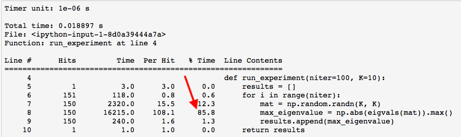
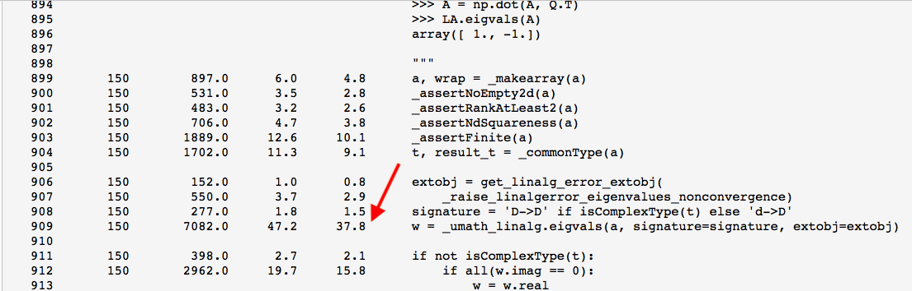

## Troubleshooting Code - timing, profiling and tracing
<br>
If you are using an IDE such as Eclipse to debug your code then you have a rich set of tools at your disposal. If you are working in the terminal or in Jupyter then here are some useful tools to help you troubleshoot your code. Below is the function called "run_experiment" that computes the eigenvalues of a K x K input matrix. Before we get started though, you may have to install the following packages.
<br>

> pip install timeit <br>
> pip install line_profiler  <br>
> pip install memory_profiler  <br>
> pip install pdb <br>


```python
import numpy as np
from numpy.linalg import eigvals

def run_experiment(niter=100, K=10):
    results = []
    for i in range(niter):
        mat = np.random.randn(K, K)
        max_eigenvalue = np.abs(eigvals(mat)).max()
        results.append(max_eigenvalue)
    return results
some_results = run_experiment()
print("Largest eigenvalue calculated: {0}".format(np.max(some_results)))
```

    Largest eigenvalue calculated: 5.344516334386579


### Timing Code

You can use the "time" package to simply time a block of code as is done below. 


```python
import time
t0 = time.time()

run_experiment(niter=50, K=5)

t1 = time.time()
print("Execution time: {0}".format(t1-t0))
```

    Execution time: 0.004379987716674805


If you want to get more information about how long a certain function takes to run you can use the "timeit" package as per below where you can specify to take an average over three runs.


```python
import timeit
t0 = time.time()

%timeit -r 3 run_experiment(niter=200, K=15)

t1 = time.time()
print("Execution time: {0}".format(t1-t0))
```

    26.5 ms ± 1.89 ms per loop (mean ± std. dev. of 3 runs, 10 loops each)
    Execution time: 1.0858049392700195


```python
print((26.5e-3 + 1.89e-3) * 3 * 10)
```

    0.8516999999999999


The timeit package estimated an average run time of 26.5ms (+- 1.89ms) for the run_experiment(niter=200, K=15) function over the course of three runs with 10 loops each. That is roughly .85 seconds although timing timeit recorded a total of 1.09 seconds. It seems feasible that a quarter of a second was spent by the os or system dealing with housekeeping. So now you have an idea how long your function takes to run on average given a certain set of inputs. So what if you want to find out even more information? In this case you can use the "line_profiler" package. Note that you do not need to update the code with the **@profile** decorator.
<br>

### Profiling Code


```python
%load_ext line_profiler
%lprun -f run_experiment run_experiment(niter=150, K=10)
```

As you can see by the output, 86% of the time was spent calculating the eigenvalues. If you want to go deeper you can ask lprun to profile a function inside of run_experiment as is done below. Instead of profiling run_experiment itself, you are going to profile the eigenvals() function.<br>




```python
%lprun -f eigvals run_experiment(niter=150)
```

So now you can see that roughly 38% of the time is spent in the function ""
<br>



### Memory Profiling Code
<br>
If instead of time you want to see how much memory a particular function is using, then you can invoke the "memit" profiler tool. Below, out of three runs, the memory profiler calculated a peak memory usage of 49 MiB for the run_experiment() function.


```python
%load_ext memory_profiler
%memit -r 3 run_experiment(niter=200, K=15)
```

    The memory_profiler extension is already loaded. To reload it, use:
      %reload_ext memory_profiler
    peak memory: 49.39 MiB, increment: 0.02 MiB


### Tracing Code 
<br>
Now if you want to trace the code also known as debugging, then you can use the "pdb" package. This will allow you to step through the code and see what is going on inside of it. For a list of commands you can refer to the [python debugger page](https://docs.python.org/2/library/pdb.html)<br><br>


```python
import pdb
pdb.set_trace()
run_experiment(niter=5, K=3)
```

    --Return--
    > <ipython-input-9-363c57a97903>(2)<module>()->None
    -> pdb.set_trace()
    (Pdb) s
    > /Users/gonzalobriceno/venvp3/lib/python3.5/site-packages/IPython/core/interactiveshell.py(2913)run_code()
    -> sys.excepthook = old_excepthook
    (Pdb) continue


    [1.6156927800854413,
     1.8905887143646258,
     1.7111310677162486,
     1.5509143737840982,
     2.9387394467077232]


