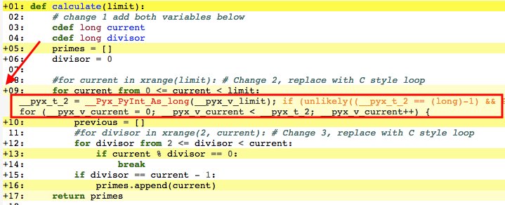

## Use Cython to speed up Python  
<br>
Often times Python code may be slower than C and this occurs for a variety of reasons although loops that use iterators, and dynamically typed variable declarations are usually to blame; at the very least these are the low hanging fruit that, when addressed, can dramatically improve performance with very little effort. For example, [statically typed](http://cython.readthedocs.io/en/latest/src/quickstart/cythonize.html) varaibles allow Cython to produce leaner and faster code. The example below shows how a prime number brute force Python loop that takes a half a second on my machine can be sped up to take less than a tenth of a second. 

First you **need** to have the following packages installed (however you prefer to do so):
> pip install python-dev<br>
>pip install cython


### The usual Python code

So imagine that you have the following python code in the file **prime.py**. As you can see this is a brute force way to find the primes that fall between 1 and the *limit* input. 

```
def calculate(limit):
    primes = []
    divisor = 0
    for current in xrange(limit):
        previous = []
        for divisor in xrange(2, current):
            if current % divisor == 0:
                break
        if divisor == current - 1:
            primes.append(current)
    return primes

def main():
    print calculate(1000)
    
if __name__ == "__main__":
    main()
```

If you were to test this code as follows you would see that it takes *x* amount of time to run. 

```
import prime
from timeit import Timer

# Test either python prime function or cython c_prime
t = Timer('prime.calculate(10000)', 'import prime')

reps = 5
print "average run time {} seconds".format(sum(t.repeat(repeat=reps, number=1)) / reps)
```

### How to speed things up with Cython

Cython is a Python compiler that generates Python modules that have been translated into C. This translation process results in significant performance gains although the translated code makes many calls to the Cython interpreter. Anyway, to get those gains this is what needs to happen:

* copy the code that you want to speed up, in this case **prime.py**, into a **.pyx** file. So for example, name it **c_prime.pyx**
* create a **translate.py** file that takes care of translating the **c_prime.pyx** file into the C translated code. In this case the translated file will be named **c_prime.c**

```
from distutils.core import setup
from distutils.extension import Extension
from Cython.Distutils import build_ext

setup(
  name = 'PrimeTest',
  ext_modules=[
    Extension('c_prime', ['c_prime.pyx'])
    ],
  cmdclass = {'build_ext': build_ext}
)
```
* make the corresponding changes to the **c_prime.pyx** file so as to take advantage of the translation to C. **This is the key step in the whole process.** There are surely many ways to improve on the code, however, I will cover only two simple changes that result in a nearly 600% increase in speed:
  * make static variable declarations
  * replace python loops with C native loops

Below is the updated code that takes c_prime.pyx, originally a copy of prime.py, into an improved code that after running through the translation process will produce the speed gains. Notice the explicit variable declarations via the 'cdef long' declarations as well as the updated for loops (two in this case):

```
def calculate(limit):
    # change 1 add both variables below
    cdef long current
    cdef long divisor
    primes = []
    divisor = 0
        
    #for current in xrange(limit): # Change 2, replace with C style loop
    for current from 0 <= current < limit:
        previous = []
        #for divisor in xrange(2, current): # Change 3, replace with C style loop
        for divisor from 2 <= divisor < current:
            if current % divisor == 0:
                break
        if divisor == current - 1:
            primes.append(current)
    return primes
```
* translate the Python code into the Cython module via the command

> python translate.py build_ext --inplace

And that is all. If the translation step worked you should be able to run the second code block above albeit with the following command instead of calling **prime.py**

```
t = Timer('c_prime.calculate(10000)', 'import prime')
```

You should see roughly a 600% increase in speed. That is pretty neat considering how little effor it took. As mentioned previously, the key step is in changing the original Python code so that the translation to C makes as much use of the C language as possible. And there is a very good tool to help you toward that goal. If you run the command below a .html file will be generated where the lines that are highlighted yellow indicate code that stands to gain from updates. 

> cython c_prime.pyx -a

In the image below you will see that the for loop in line 9 became a single line of C code (this can be gleaned by clicking on the '+' sign by line 9 and seeing that there is only one like of code there). Previously, this loop was something like 20 commands or so. 



If you want to read more about speeding up Python and how to speed up Python via Cython in particular have a look at this [quantecon article](https://lectures.quantecon.org/py/need_for_speed.html).
